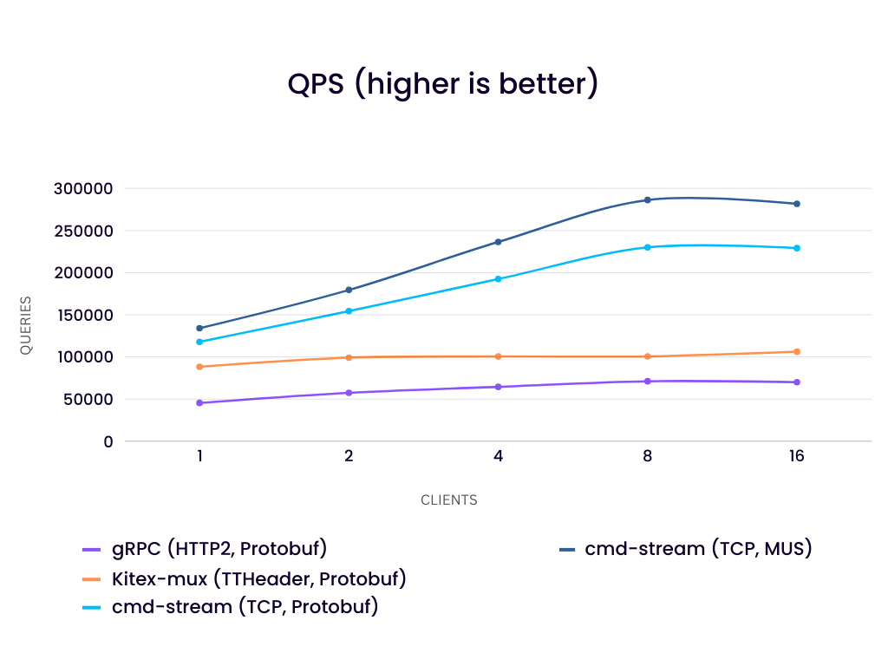
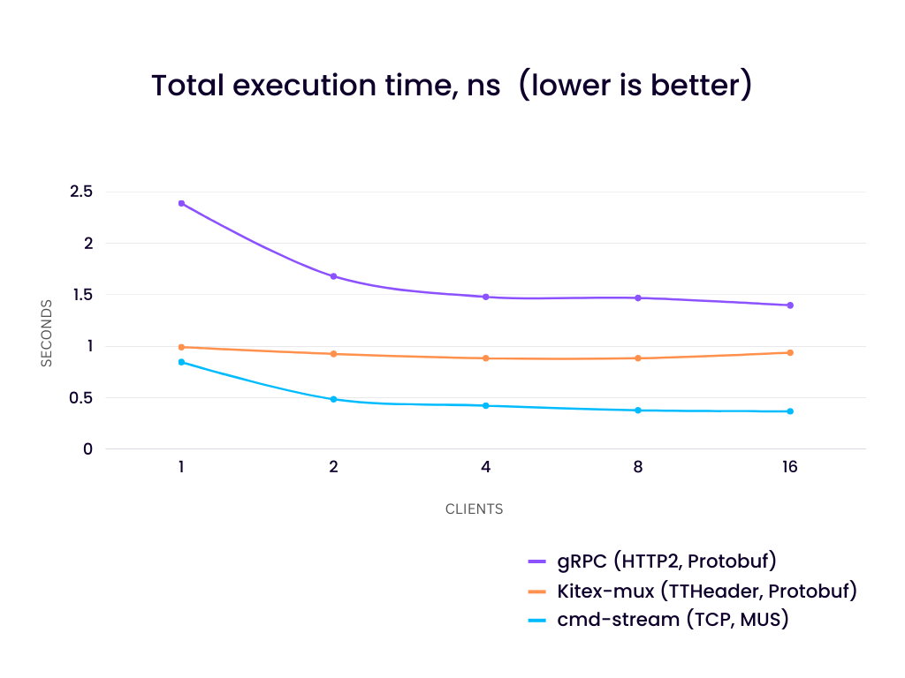
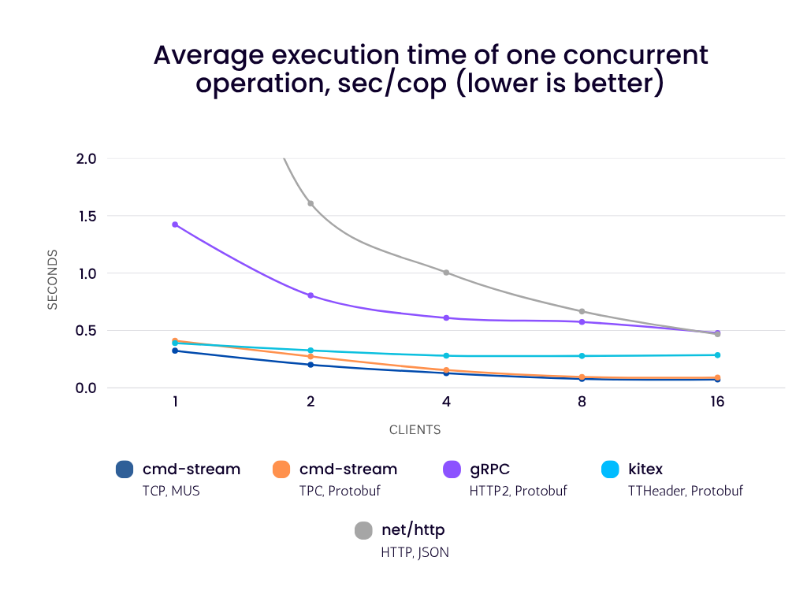
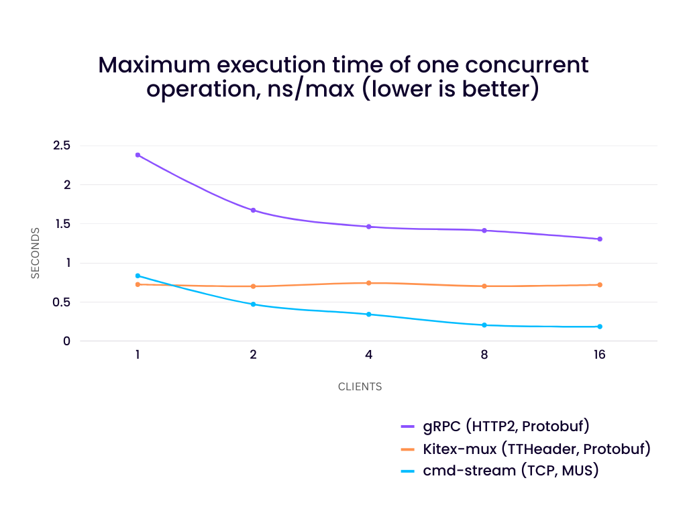
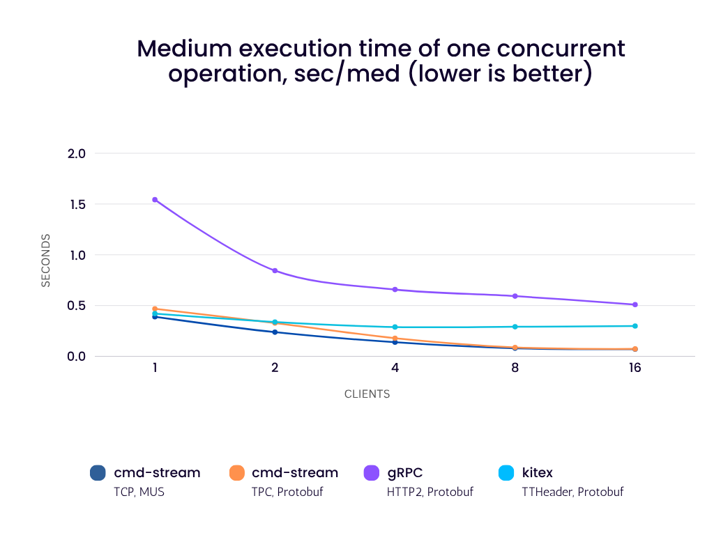
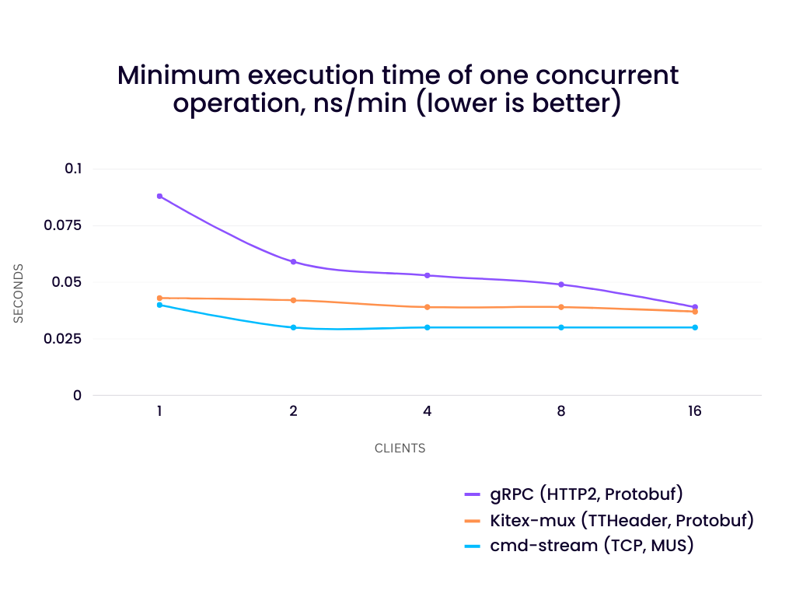
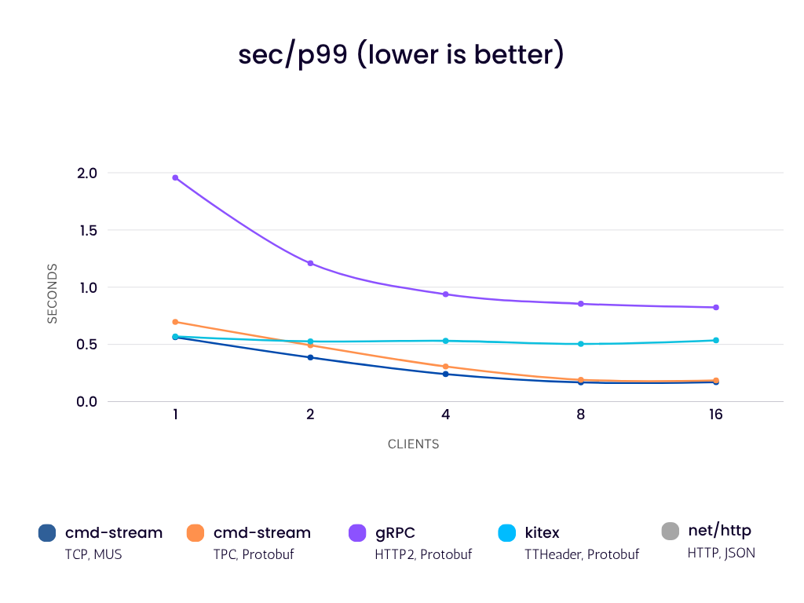
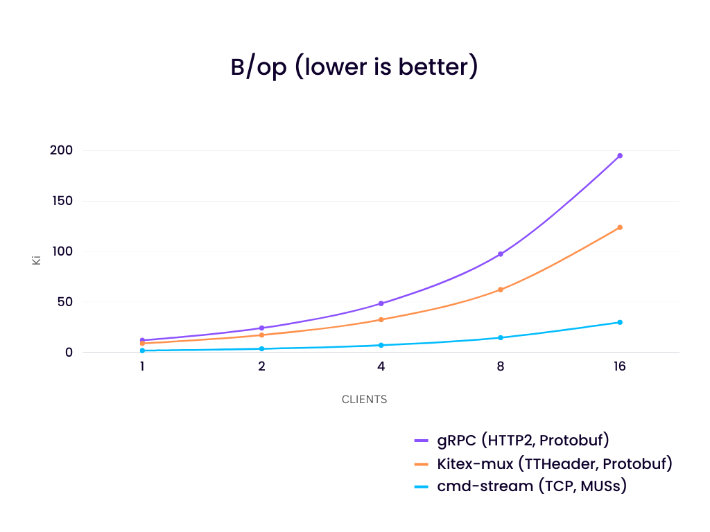
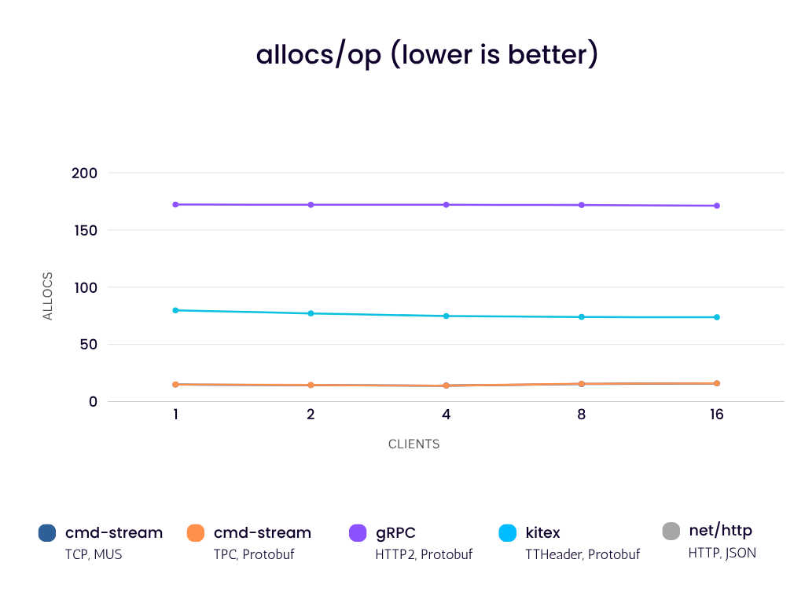

# go-inter-server-communication-benchmarks
This project compares the performance of several Golang libraries/frameworks for
inter-server communication.

# Short Benchmarks Description
In this benchmarks 1,2,4,8,16 clients send echo requests to the server as
follows:
- Each client uses only one connection and executes all echo requests
  simultaneously in separate goroutines.
- Size of the data varies from 17 to 1024 bytes.
- The size of the read and write buffers is limited to 4096 bytes.
- The delay of each response on the server is 30 ms.
- The received data is checked - it must match the sent data.

# Results
All [results](result) were obtained on a single laptop (with the connected 
charger and fan running at full speed):
- CPU: AMD Ryzen 7 PRO 5850U with Radeon Graphics
- OS: Gentoo 5.19.9-gentoo x86_64 GNU/Linux
- Go: 1.20.3

with the following commands:
```
CLIENTS_COUNT=n GEN_SIZE=m go test -bench=BenchmarkQPS_... -count=10
CLIENTS_COUNT=n GEN_SIZE=m go test -bench=BenchmarkFixed_... -benchtime=(100000/n)x -benchmem -count=10
```
, where `n` - the number of clients, `m` - the number of generated test data.




To get more comparable results, let's check how well all participants can 
handle 100,000 simultaneous requests:









